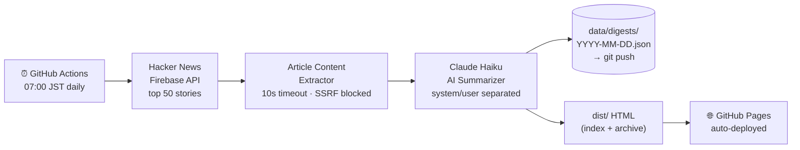

<div align="center">

# 📰 Tech Digest

**Claude AI curates and summarizes the best Hacker News articles daily in Japanese,
auto-published to GitHub Pages via GitHub Actions — zero server costs.**

[](https://github.com/HayatoToyoda/tech-digest/actions/workflows/daily-digest.yml)
[](LICENSE)
[](https://nodejs.org/)
[](src/__tests__)

**[→ View Today's Digest](https://hayatotoyoda.github.io/tech-digest/)**

</div>

<div align="right">🌐 <a href="README.md">日本語</a> | <b>English</b></div>

---

## The Problem

You open Twitter, scroll through the feed. Then Instagram. Then Hacker News — good articles, but all in English. Parse the title, judge whether it's worth reading, skim the content. Repeat for a dozen more. Thirty minutes later, you're drained and still not sure what actually mattered today.

The problem isn't a lack of information. It's the daily exhaustion of curating and processing it all on your own.

**Tech Digest does the curation for you:**

- Fetches the **top 50 Hacker News articles** every morning at 07:00 JST
- Claude AI **selects, categorizes, and summarizes** the most important ones in Japanese
- Publishes a clean digest to **GitHub Pages** automatically — no server, no maintenance

---

## Output Example

```
#1  [Security]  TechCrunch
Iran-linked hackers breach FBI director's personal email

FBIディレクターの個人メールアカウントがイラン系ハッカー集団に侵害された。
標的型スピアフィッシングにより認証情報が盗まれ、機密性の高い通信内容が
流出した可能性がある。米政府機関の高官を標的にした攻撃の高度化を示す事例。

重要な理由: 政府高官への標的型攻撃の深刻化と、個人アカウントの
           セキュリティ管理の重要性を改めて示している
対象読者:  セキュリティ担当者・政策立案者・ITエンジニア全般
```

> Note: All digest content is generated in Japanese regardless of the source article language.

Categories: **AI / Web / Security / OSS / Platform** — Claude auto-classifies each article and outputs a summary, importance rationale, and target audience.

---

## Quick Start

> Fork → Add secret → Enable Pages → **Done in 3 minutes**

### 1. Fork this repository

```bash
gh repo fork HayatoToyoda/tech-digest --clone
```

### 2. Add your Anthropic API key

Go to **Settings → Secrets and variables → Actions** and add:

| Secret | Value |
|---|---|
| `ANTHROPIC_API_KEY` | Get yours at [console.anthropic.com](https://console.anthropic.com/) |

### 3. Enable GitHub Pages

**Settings → Pages → Source**: set to `GitHub Actions`

Then trigger a first run: **Actions → Daily Tech Digest → Run workflow**

Your digest will be live at `https://<your-username>.github.io/tech-digest/`.

> Tip: Run `npm test` locally first to verify your setup before triggering the workflow.

### (Optional) Receive the digest via Gmail

Email delivery is **off by default**. To enable it, **you (the repo owner) must configure the following** — no addresses need to be hardcoded in the repo.

1. Create a project in [Google Cloud Console](https://console.cloud.google.com/), enable the **Gmail API**
2. Create an **OAuth 2.0 Client ID** (e.g. Desktop app) and copy the client ID and secret
3. Locally, put `GMAIL_CLIENT_ID` and `GMAIL_CLIENT_SECRET` in `.env`, run `npx tsx scripts/get-gmail-token.ts`, complete the browser consent flow, and copy the **refresh token** shown in the terminal
4. Add these under **Settings → Secrets and variables → Actions**:

| Secret | Description |
|---|---|
| `GMAIL_CLIENT_ID` | OAuth client ID |
| `GMAIL_CLIENT_SECRET` | OAuth client secret |
| `GMAIL_REFRESH_TOKEN` | Refresh token from step 3 |
| `GMAIL_TO` | To recipients (comma-separated for multiple) |
| `GMAIL_CC` | (Optional) Cc recipients (comma-separated). **If omitted, no Cc header is added** |

The `daily-digest.yml` workflow’s **Send email digest** step reads these secrets. Skip `GMAIL_CC` if you do not need Cc.

---

## How It Works



---

## Tech Stack

| Layer | Technology |
|---|---|
| Runtime | Node.js 22, TypeScript (via tsx) |
| AI | Claude Haiku (`claude-haiku-4-5-20251001`) |
| Data source | Hacker News Firebase API |
| Testing | Vitest (46 tests) |
| CI/CD | GitHub Actions (SHA-pinned) |
| Hosting | GitHub Pages |

---

## Security

| Risk | Mitigation |
|---|---|
| **Prompt Injection** | Instructions in `system` parameter only; article data stays in `user` role |
| **SSRF** | Private IPs (10.x / 172.16-31.x / 192.168.x / 127.x / 169.254.x) and non-http(s) URLs blocked |
| **XSS** | All output sanitized via `escapeHtml` and `safeHref`; `javascript:` URLs blocked |
| **Timeouts** | 10-second `AbortController` timeout on every external fetch |
| **Least privilege** | Build and deploy jobs separated with minimal permission scopes |
| **Supply chain** | All Actions pinned to exact commit SHAs; `npm audit` runs on every build |

---

## Local Development

```bash
npm install

# Generate digest (requires ANTHROPIC_API_KEY — Claude API calls will be made)
ANTHROPIC_API_KEY=sk-ant-... npm run build
# → generates data/digests/YYYY-MM-DD.json and HTML files under dist/

# Run tests
npm test

# Type check
npx tsc --noEmit
```

The generated page is available at `dist/index.html`.

---

## License

MIT — Feel free to fork and run your own digest.

This is a personal project. Forks and customizations are welcome, but Issues and PRs are not accepted at this time.
