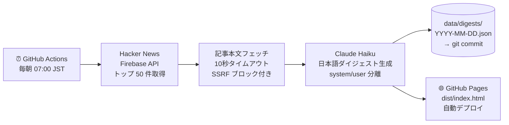

<div align="center">

# 📰 Tech Digest

**毎朝 Claude AI が Hacker News のトップ記事を日本語で要約し、
GitHub Actions が GitHub Pages へ自動公開する — サーバー不要・運用コストゼロ。**

[](https://github.com/HayatoToyoda/tech-digest/actions/workflows/daily-digest.yml)
[](LICENSE)
[](https://nodejs.org/)
[](src/__tests__)

**[→ 今日のダイジェストを読む](https://hayatotoyoda.github.io/tech-digest/)**

</div>

---

## なぜ作ったか

英語のテックニュースを毎朝チェックするのは思った以上に認知コストがかかる。
タイトルを読み、重要度を判断し、内容を把握する — これを毎日続けるのは大変だ。

**Tech Digest はこの作業をすべて自動化する：**

- 毎朝 07:00 JST に **Hacker News のトップ 50 件**を自動収集
- Claude AI が **重要度判定・カテゴリ分類・日本語要約**を一括生成
- GitHub Actions が **GitHub Pages へ自動デプロイ** — サーバー不要・無料で動く

---

## 仕組み



---

## 出力例

```
#1  [Security]  TechCrunch
Iran-linked hackers breach FBI director's personal email

FBIディレクターの個人メールアカウントがイラン系ハッカー集団に侵害された。
標的型スピアフィッシングにより認証情報が盗まれ、機密性の高い通信内容が
流出した可能性がある。米政府機関の高官を標的にした攻撃の高度化を示す事例。

重要な理由: 政府高官への標的型攻撃の深刻化と、個人アカウントの
           セキュリティ管理の重要性を改めて示している
対象読者:  セキュリティ担当者・政策立案者・ITエンジニア全般
```

カテゴリは **AI / Web / Security / OSS / Platform** の 5 種類。
Claude が各記事を自動分類し、要約・重要理由・対象読者を出力する。

---

## セットアップ（3 ステップ · 約 3 分）

> Fork → シークレット追加 → Pages 有効化 → 完了

### 1. リポジトリを Fork

```bash
gh repo fork HayatoToyoda/tech-digest --clone
```

### 2. Anthropic API キーを追加

リポジトリの **Settings → Secrets and variables → Actions** に追加：

| シークレット名 | 値 |
|---|---|
| `ANTHROPIC_API_KEY` | [Anthropic Console](https://console.anthropic.com/) で取得 |

### 3. GitHub Pages を有効化

**Settings → Pages → Source** を `GitHub Actions` に設定。

**Actions → Daily Tech Digest → Run workflow** で初回テスト実行。

`https://<your-username>.github.io/tech-digest/` でダイジェストが公開される。

---

## ローカル開発

```bash
npm install

# ダイジェスト生成（ANTHROPIC_API_KEY 必要）
ANTHROPIC_API_KEY=sk-ant-... npm run build

# テスト実行
npm test

# 型チェック
npx tsc --noEmit
```

生成されたページは `dist/index.html` をブラウザで開いて確認できる。

---

## 技術スタック

| レイヤー | 技術 |
|---|---|
| ランタイム | Node.js 22, TypeScript (tsx で直接実行) |
| AI | Claude Haiku (`claude-haiku-4-5-20251001`) |
| データソース | Hacker News Firebase API |
| テスト | Vitest (46 テスト) |
| CI/CD | GitHub Actions (SHA 固定) |
| ホスティング | GitHub Pages |

---

## セキュリティ対策

このプロジェクトは AI + 外部 API を組み合わせるため、以下のセキュリティ対策を実施している。

| リスク | 対策 |
|---|---|
| **Prompt Injection** | 指示は `system` パラメータのみ。記事データは `user` ロールに分離 |
| **SSRF** | プライベート IP（10.x / 172.16-31.x / 192.168.x / 127.x / 169.254.x）・非 http(s) URL を拒否 |
| **XSS** | 全出力に `escapeHtml` · `safeHref` を適用。`javascript:` URL もブロック |
| **タイムアウト** | 全外部フェッチに 10 秒 `AbortController` タイムアウト |
| **最小権限** | build ジョブと deploy ジョブを分離し、権限スコープを最小化 |
| **サプライチェーン** | GitHub Actions を全て SHA で固定。CI で `npm audit --audit-level=high` を毎回実行 |

---

## ライセンス

MIT — Fork して自分のダイジェストを作ってみてください。

**English README**: [README.md](README.md)
