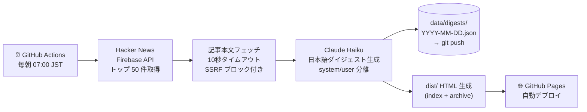

<div align="center">

# 📰 Tech Digest

**毎朝 Claude AI が Hacker News のトップ記事を選別・分類して日本語で要約し、
GitHub Actions が GitHub Pages へ自動公開する — サーバー不要・運用コストゼロ。**

[](https://github.com/HayatoToyoda/tech-digest/actions/workflows/daily-digest.yml)
[](LICENSE)
[](https://nodejs.org/)
[](src/__tests__)

**[→ 今日のダイジェストを読む](https://hayatotoyoda.github.io/tech-digest/)**

</div>

<div align="right">🌐 <b>日本語</b> | <a href="README.en.md">English</a></div>

---

## なぜ作ったか

朝起きてスマホを開くと、気づけば Twitter や Instagram のフィードをダラダラとスクロールしている。
テック系の話題、誰かの意見、広告——情報は次々と流れてくるが、何が重要で何がノイズかを
判断しながら読み進めるのは思った以上に消耗する。

Hacker News を開けば良質な記事は並んでいる。ただし英語で。タイトルを読み解き、
重要度を判断し、本文をかいつまんで理解する。それを何本も繰り返す。
気づけば 30 分が過ぎ、疲れた割には「今日のテックシーンで何が起きたか」がぼんやりとしか掴めていない。

この**キャッチアップ疲れ**を解決するために作ったのが Tech Digest だ。

**毎朝 1 ページを 2 分で読むだけで済む：**

- 毎朝 07:00 JST に **Hacker News のトップ 50 件**を自動収集
- Claude AI が **重要度判定・カテゴリ分類・日本語要約**を一括生成
- GitHub Actions が **GitHub Pages へ自動デプロイ** — サーバー不要・無料で動く

---

## 出力例

```
#1  [Security]  TechCrunch
Iran-linked hackers breach FBI director's personal email

FBIディレクターの個人メールアカウントがイラン系ハッカー集団に侵害された。
標的型スピアフィッシングにより認証情報が盗まれ、機密性の高い通信内容が
流出した可能性がある。米政府機関の高官を標的にした攻撃の高度化を示す事例。

重要な理由: 政府高官への標的型攻撃の深刻化と、個人アカウントの
           セキュリティ管理の重要性を改めて示している
対象読者:  セキュリティ担当者・政策立案者・ITエンジニア全般
```

カテゴリは **AI / Web / Security / OSS / Platform** の 5 種類。
Claude が各記事を自動分類し、要約・重要理由・対象読者を出力する。

---

## セットアップ（3 ステップ・約 3 分）

> Fork → シークレット追加 → Pages 有効化 → 完了

### 1. リポジトリを Fork

```bash
gh repo fork HayatoToyoda/tech-digest --clone
```

### 2. Anthropic API キーを追加

リポジトリの **Settings → Secrets and variables → Actions** に追加：

| シークレット名 | 値 |
|---|---|
| `ANTHROPIC_API_KEY` | [Anthropic Console](https://console.anthropic.com/) で取得 |

### 3. GitHub Pages を有効化

**Settings → Pages → Source** を `GitHub Actions` に設定。

**Actions → Daily Tech Digest → Run workflow** で初回テスト実行。

`https://<your-username>.github.io/tech-digest/` でダイジェストが公開される。

> ヒント: 事前に `npm test` でローカル確認しておくと、問題の切り分けが楽になる。

### （任意）Gmail でダイジェストをメール受信

メール配信は**既定では無効**です。使う場合は、**リポジトリ所有者が次を自分で設定**します（公開 Fork でもメールアドレスをコードに書かずに済みます）。

1. [Google Cloud Console](https://console.cloud.google.com/) でプロジェクトを作成し、**Gmail API** を有効化する
2. **OAuth 2.0 クライアント ID**（デスクトップアプリなど）を作成し、クライアント ID / シークレットを取得する
3. ローカルで `.env` に `GMAIL_CLIENT_ID` と `GMAIL_CLIENT_SECRET` を置き、`npx tsx scripts/get-gmail-token.ts` を実行してブラウザ認証し、表示された**リフレッシュトークン**を控える
4. リポジトリの **Settings → Secrets and variables → Actions** に、次を追加する

| シークレット名 | 説明 |
|---|---|
| `GMAIL_CLIENT_ID` | OAuth クライアント ID |
| `GMAIL_CLIENT_SECRET` | OAuth クライアントシークレット |
| `GMAIL_REFRESH_TOKEN` | 手順 3 で取得したリフレッシュトークン |
| `GMAIL_TO` | 宛先（To）。カンマ区切りで複数可 |
| `GMAIL_CC` | （任意）CC。カンマ区切りで複数。**未設定なら Cc ヘッダーは付かない** |

ワークフロー `daily-digest.yml` の「Send email digest」ステップがこれらのシークレットを読み込みます。CC が不要なら `GMAIL_CC` は登録しなくて構いません。

---

## 仕組み



---

## 技術スタック

| レイヤー | 技術 |
|---|---|
| ランタイム | Node.js 22, TypeScript (tsx で直接実行) |
| AI | Claude Haiku (`claude-haiku-4-5-20251001`) |
| データソース | Hacker News Firebase API |
| テスト | Vitest (46 テスト) |
| CI/CD | GitHub Actions (SHA 固定) |
| ホスティング | GitHub Pages |

---

## セキュリティ対策

AI と外部 API を組み合わせるシステムのため、以下の対策を実施している。

| リスク | 対策 |
|---|---|
| **Prompt Injection** | 指示は `system` パラメータのみ。記事データは `user` ロールに分離 |
| **SSRF** | プライベート IP（10.x / 172.16-31.x / 192.168.x / 127.x / 169.254.x）・非 http(s) URL を拒否 |
| **XSS** | 全出力に `escapeHtml` · `safeHref` を適用。`javascript:` URL もブロック |
| **タイムアウト** | 全外部フェッチに 10 秒 `AbortController` タイムアウト |
| **最小権限** | build ジョブと deploy ジョブを分離し、権限スコープを最小化 |
| **サプライチェーン** | GitHub Actions を全て SHA で固定。CI で `npm audit --audit-level=high` を毎回実行 |

---

## ローカル開発

```bash
npm install

# ダイジェスト生成（ANTHROPIC_API_KEY 必要・Claude API の呼び出しが発生します）
ANTHROPIC_API_KEY=sk-ant-... npm run build
# → data/digests/YYYY-MM-DD.json と dist/ 以下の HTML が生成される

# テスト実行
npm test

# 型チェック
npx tsc --noEmit
```

生成されたページは `dist/index.html` をブラウザで開いて確認できる。

---

## ライセンス

MIT — Fork して自分のダイジェストを作ってみてください。

このリポジトリは個人プロジェクトです。Fork・カスタマイズは歓迎しますが、現時点では Issue・PR の受け付けは行っていません。
